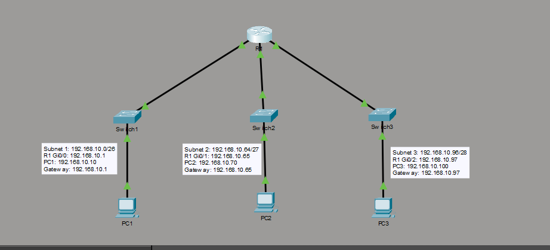
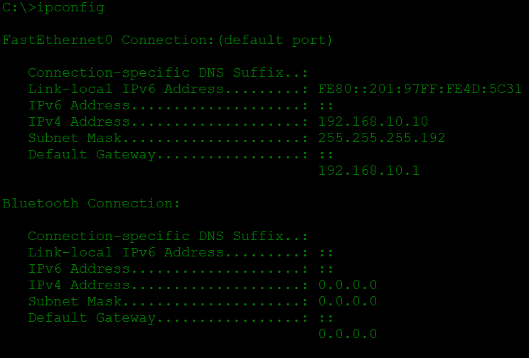
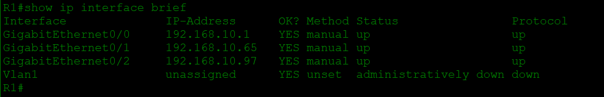
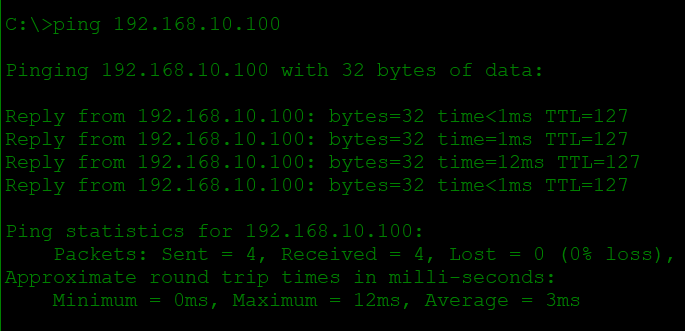

# VLSM Design
## Lab Topology

## Verification

PC1 configuration:

Router interface status:

Ping from PC1 to PC3:

## Method

1. List the host needs.
2. Sort from largest to smallest.
3. Pick the smallest prefix that fits each need.
4. Allocate the largest first, then continue from the next free address.

## Lab Address Plan

Network: 192.168.10.0/24

| Subnet | Prefix | Network | Usable range | Broadcast | Usable hosts | R1 gateway |
|--------|--------|---------|--------------|-----------|-------------:|------------|
| Switch1 / PC1 | /26 | 192.168.10.0 | .1 – .62 | .63 | 62 | 192.168.10.1 |
| Switch2 / PC2 | /27 | 192.168.10.64 | .65 – .94 | .95 | 30 | 192.168.10.65 |
| Switch3 / PC3 | /28 | 192.168.10.96 | .97 – .110 | .111 | 14 | 192.168.10.97 |

The subnets are allocated largest first and do not overlap.
